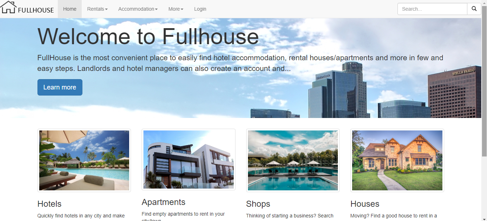
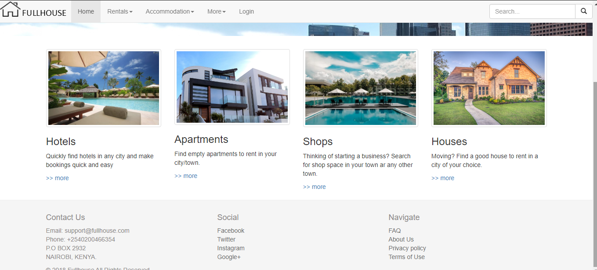
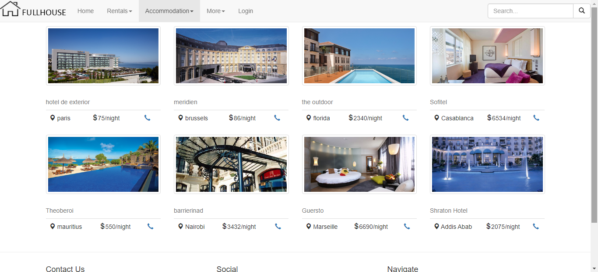
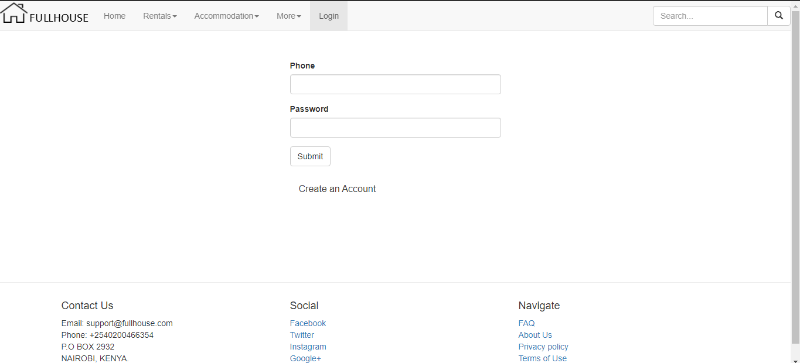
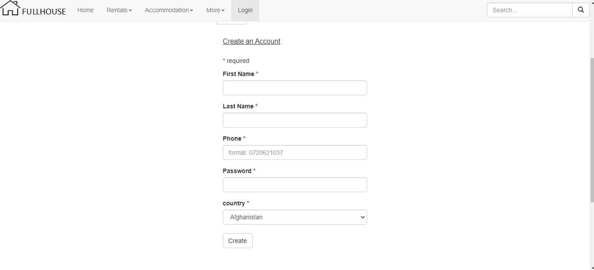

# fullhouse - A simple real estate website
Fullhouse is a real estate website that I built to familiarize myself with php and bootstrap.

## Getting started
1. Clone this repo into your local `www` folder
1. Copy the contents of the [database folder](/database) to your mysql data 

## screenshots
1. ### Home page

1. ### Home page with footer

1. ### Accomodation page

1. ### Log In page

1. ### Create Account page

1. ### About & Feedback page

