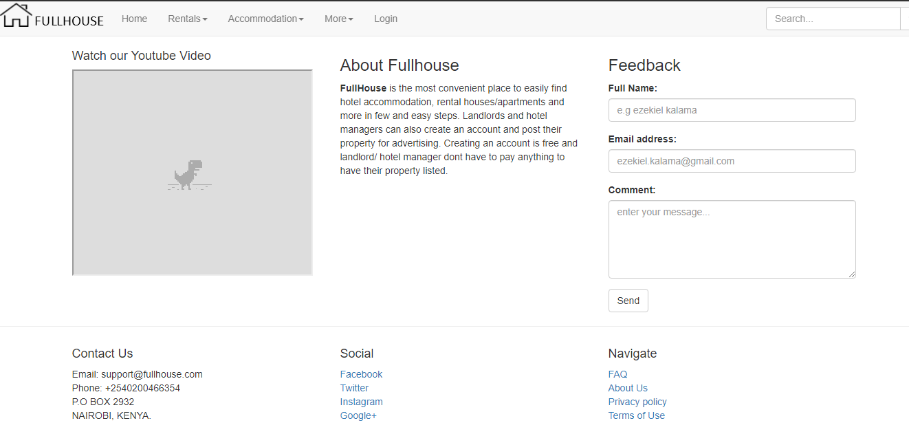

# fullhouse - A simple real estate website
Fullhouse is a real estate website that I built to familiarize myself with php and bootstrap.

## Getting started
1. Clone this repo into your local `www` folder
1. Copy the contents of the [database folder](/database) to your mysql data 

## screenshots

